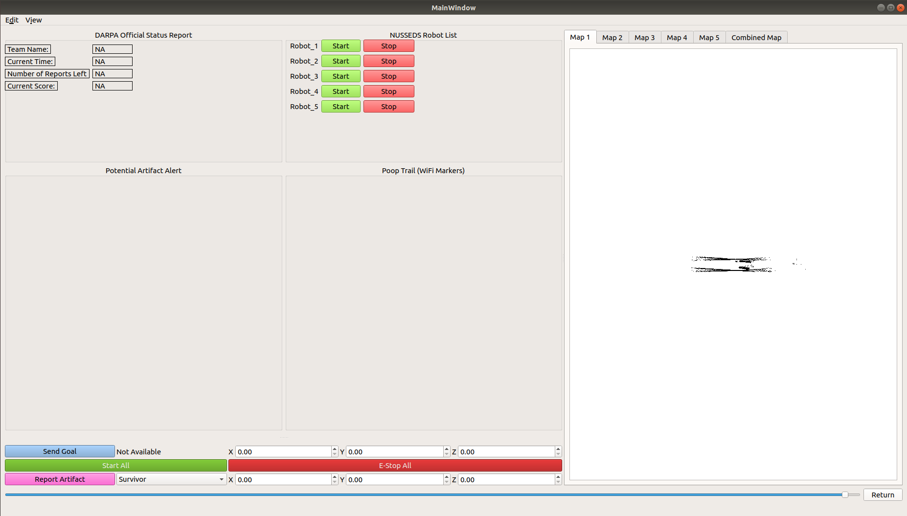

# mission_planner

User Interface for 4 UGVs and TGV as well as communication interface with DARPA competition server (via underlying interface_protocol pkg) to report artifacts and view status reports. Plan to add live map edit feature for global map correction. 

To run:
`rosrun mission_planner mission_planner_node`

Sample UI:
