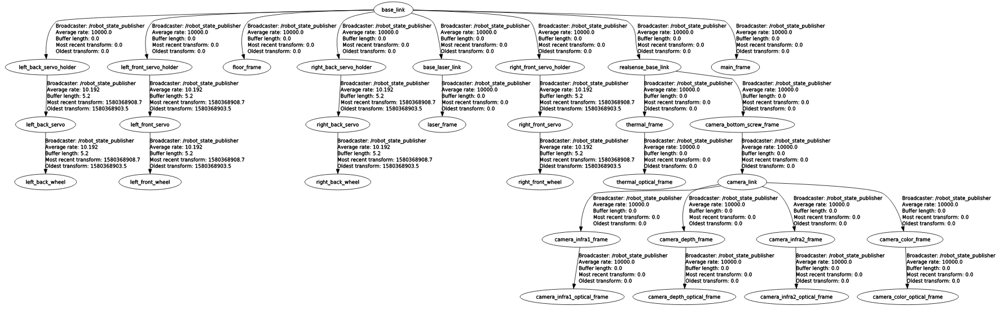

# ogv_urdf

Used to publish static TF tree of the OGV, including lidar_frame, realsense_frame, thermal_frame and floor frame (static transform to ground plane to get starting DARPA coordinate from AprilTag). 

To run, 

`roslaunch ogv_urdf ogv_urdf.launch`

Complete Static TF Tree for reference:

Visual of URDF:

